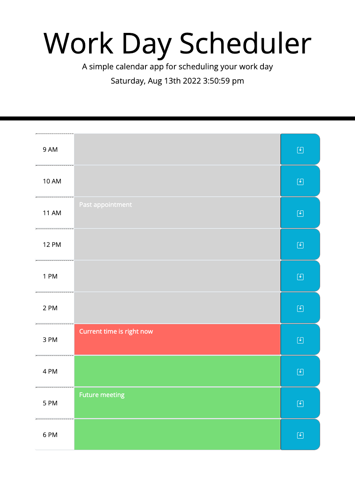

# 05 Third-Party APIs: Work Day Scheduler

## Description

This application is a simple calendar that allows a user to save events for each hour of the day. This app runs in the browser and featurs dynamically updated HTML and CSS powered by jQuery.

## Features
* When the planner is opened, the current date and time is displayed at the top of the calendar.
* Timeblocks are presented with the standard business hours
* Each timeblock is color coded to indicate whether it is in the past, present, or future. Grey is for the past, red is for the present, and green is for the future.
* If a user clicks into a timeblock, they can then enter an event.
* When the save button is clicked for that timeblock,the text for that event is saved in local storage.
* When the page is refreshed, then the saved events persist.

## Links and Preview
View the app by clicking [HERE](https://mich-hales.github.io/work-day-scheduler).

View my repository by clicking [HERE](https://github.com/mich-hales/work-day-scheduler).

Here is a screenshot of the application: 

